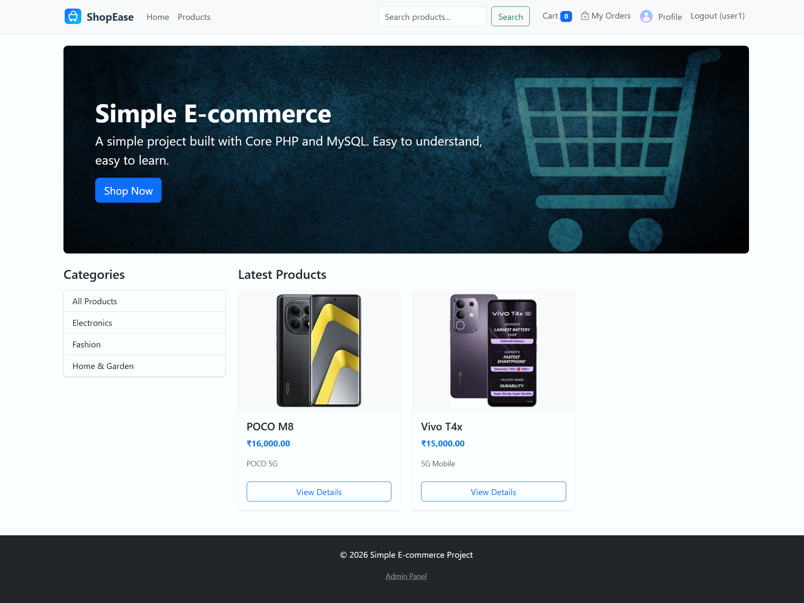
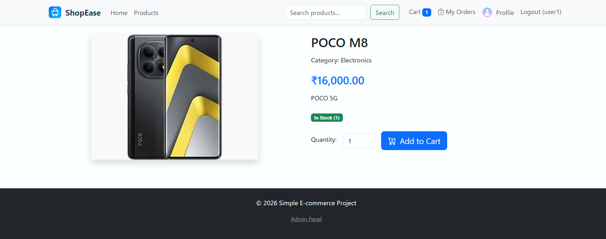
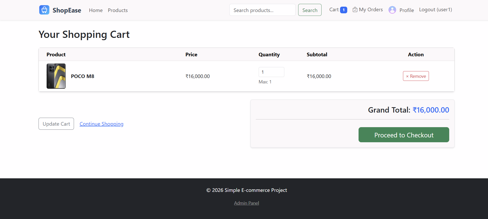
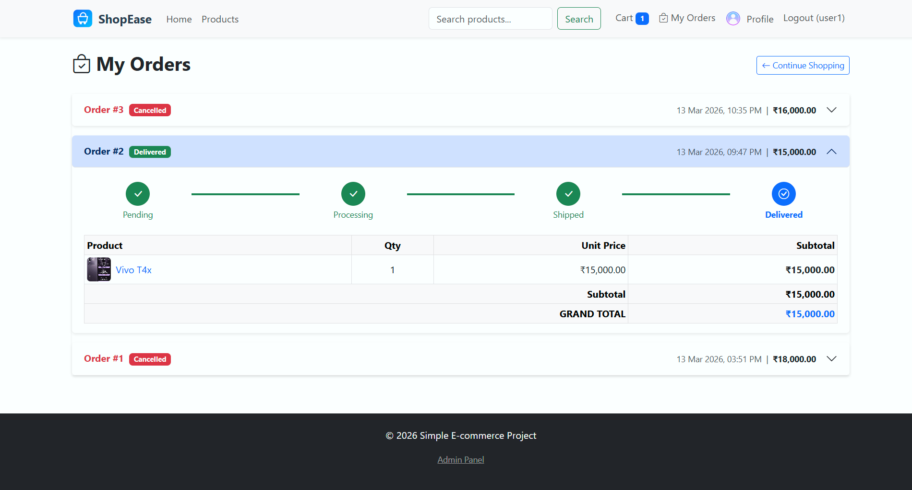
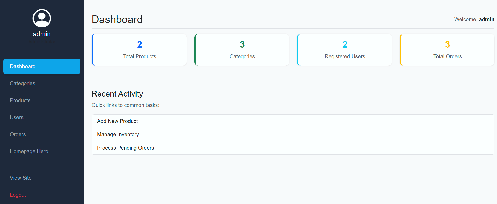
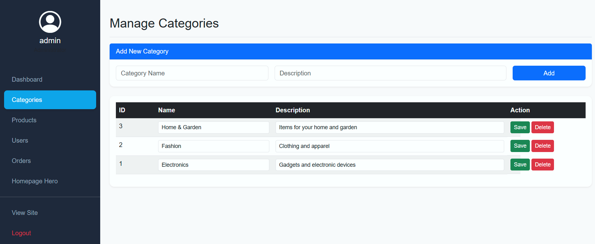
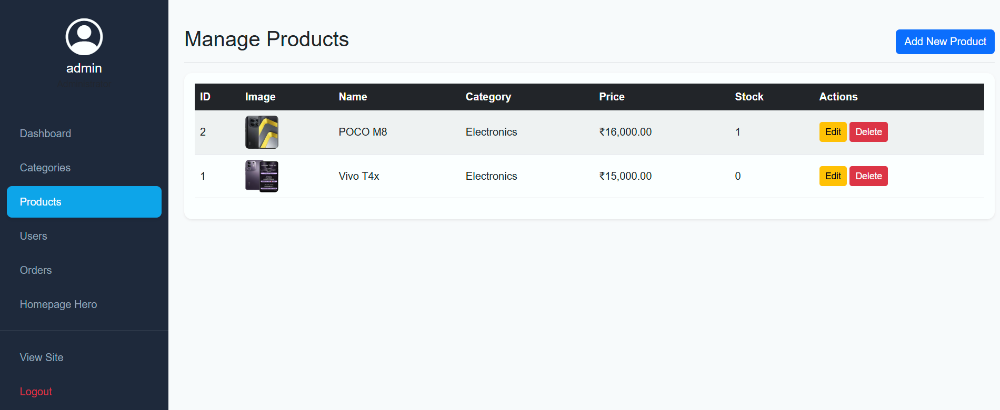
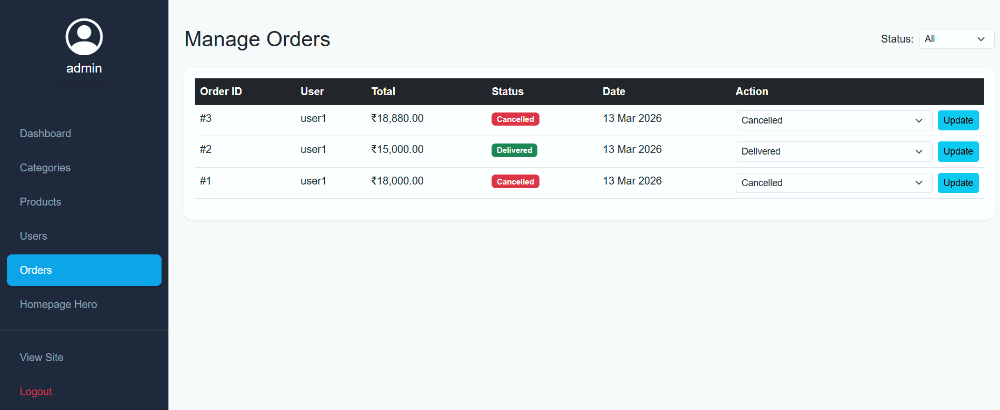

# Simple E‑commerce (PHP + MySQL)
Lightweight storefront and admin built with core PHP, MySQLi, and Bootstrap 5. No frameworks; easy to read and extend.

## What’s inside
- Public: home, product list with category/search filters, product detail, cart, checkout, register/login.
- Admin: products CRUD with image upload to `uploads/`, inline category edit/delete, order status updates, user list.
- Media: placeholder image used when a product has no upload.

## Stack
- PHP 7.4+ (core, no framework)
- MySQL/MariaDB via MySQLi
- Bootstrap 5, Bootstrap Icons
- HTML5 + CSS3

## Where features live
- Sessions: login state (users/admin) and cart contents (`includes/db.php` starts sessions; `cart.php` uses session cart).
- Cookies: remember-me for user login (`login.php` sets/clears `remember_user`).
- File uploads: product/user photos saved to `uploads/` (admin add/edit product, profile photo).
- (No caching layer): product listings read fresh data each time.

## Getting started (local)
1) Copy `simple-ecommerce` into your web root  
   - XAMPP: `C:\xampp\htdocs\simple-ecommerce`  
   - WAMP: `C:\wamp64\www\simple-ecommerce`
2) Create DB `simple_ecommerce` and import `db.sql`.
3) Browse: `http://localhost/simple-ecommerce`
4) Admin: `http://localhost/simple-ecommerce/admin/login.php`
   - Username: `admin`  
   - Password: `changeme123` (reset after first login)

## Notes
- Uploads saved to `uploads/` (auto-created by admin product forms).
- Sessions store cart and login state.
- No caching layer; reads fresh data on each request.

## Screenshots

## Demo
- `docs/demo.gif`

## Project structure
- `admin/` admin pages + includes
- `includes/` db connection, shared header/footer
- `uploads/` product/user images, logo
- Root PHP files: public pages (home, products, product detail, cart, checkout, auth)

## Showcase checklist
- [x] Add screenshots (public + admin)
- [ ] Add short demo GIF
- [x] Add license (MIT -> Educational Use License)
- [x] Change default admin password in seed (now `changeme123`; reset in production)
